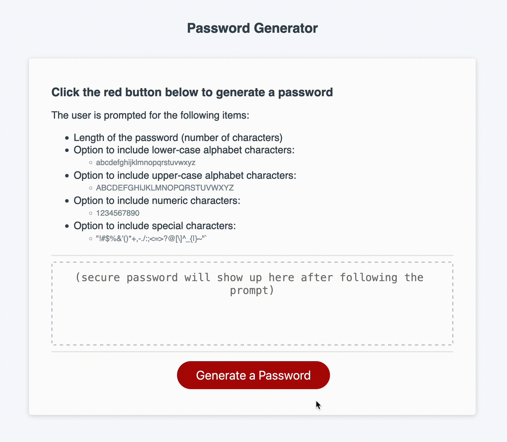

# Module 3 - JavaScript

Author: Ryan Whitmore

Written as part of the UCB Coding Bootcamp.

## Description

This module contains files for webpage that queries the user for a password length and their desired combination of possible characters and returns a randomly generated password. The password is printed to the browser window such that it can be visualized or used elsewhere.

The page ensures that the options specified by the user satisfy the acceptance criterion outlined in the requirements, which is that the password must have between 8 and 128 characters. It also ensures that a non-empty password is returned by defaulting to all lower-case alphabet characters as possible characters for the password in the instance that a user chooses not to include any of the possible character options specified in the window prompt.

## Links

TODO: add links when merged into main for deployment to site

Git repo:

Website:

## Screenshots

